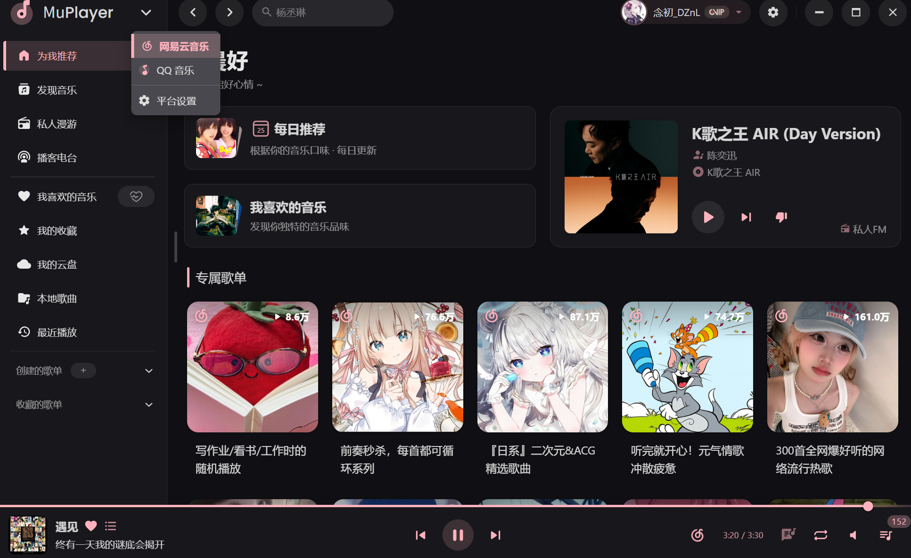
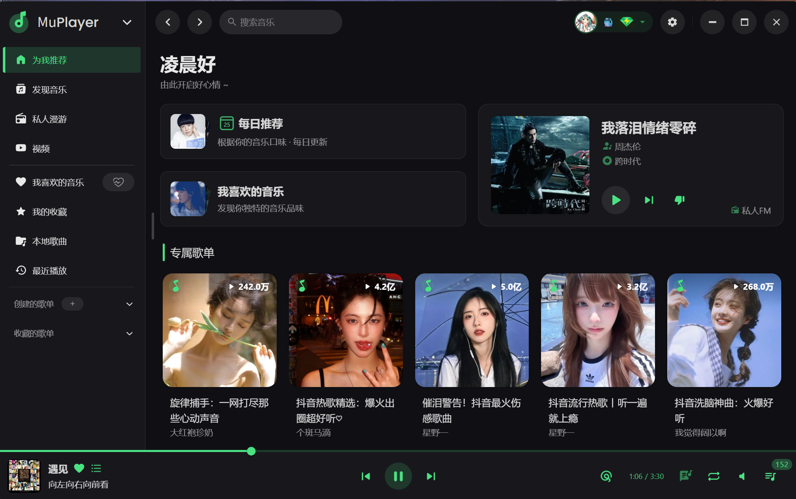
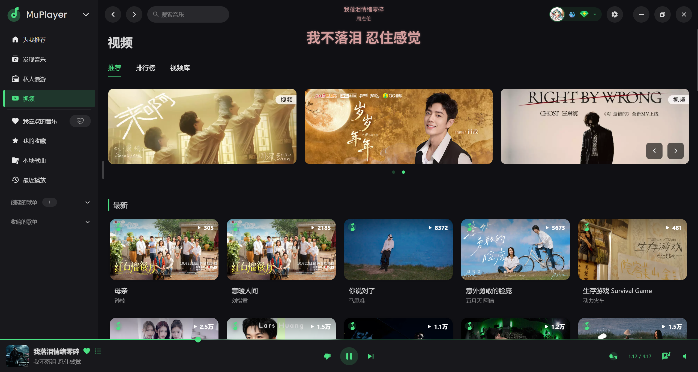

<div align="center">

# MuPlayer

**🎵 简洁优雅的多平台音乐播放器**

[](LICENSE)
[](https://www.electronjs.org/)
[](https://vuejs.org/)

支持网易云音乐、QQ 音乐 | 桌面端 + Web 端

</div>

---

## ✨ 项目特性

### 🎼 多平台支持
- **网易云音乐** - 搜索、播放、下载、歌单、评论、MV 等完整功能
- **QQ 音乐** - 搜索、播放、歌单、评论、MV（需登录会员）

### 🖥️ 多端部署
- **桌面应用** - Windows、macOS、Linux 原生支持
- **Web 应用** - Docker 容器化部署，支持静态托管
- **跨平台** - 一套代码，多端运行

### 🎨 现代化界面
- **简洁优雅** - Material Design 风格，流畅动画效果
- **响应式设计** - 自适应不同屏幕尺寸
- **深色模式** - 支持明暗主题切换

### 🚀 强大功能
- **在线播放** - 流畅的音乐播放体验
- **本地音乐** - 支持导入和管理本地音乐库
- **歌词显示** - 实时滚动歌词，支持歌词翻译
- **播放队列** - 智能播放队列管理
- **音质选择** - 多种音质可选（标准/较高/极高/无损）
- **评论互动** - 查看和浏览音乐评论
- **MV 播放** - 高清 MV 在线观看
- **歌单管理** - 收藏和管理个人歌单

---

## 📸 界面预览

### 网易云音乐 - 首页


### QQ 音乐 - 首页


### MV 播放


---

## 🚀 快速开始

### 📦 方式 1：下载桌面应用

从 [Releases](https://github.com/tlyanyu/MuPlayer/releases) 下载对应平台的安装包：

| 平台 | 安装包 |
|------|--------|
| 🪟 Windows | `MuPlayer-x.x.x-setup.exe` |
| 🍎 macOS | `muplayer-x.x.x.dmg` |
| 🐧 Linux | `muplayer-x.x.x.AppImage` / `muplayer_x.x.x_amd64.deb` |

> **提示**：纯前端应用，需要启动后在服务器设置中填入后端地址。网易云在线播放与下载由账户实际权益决定，QQ音乐只有登录且为会员才能在线播放，暂不支持下载。

### 🐳 方式 2：Docker 部署

**快速运行**（仅前端）：

```bash
docker run -d \
  --name muplayer \
  -p 25884:25884 \
  -e VITE_API_BACKEND=http://your-server:3000 \
  -e VITE_DEPLOY_MODE=container \
  --restart unless-stopped \
  ghcr.io/tlyanyu/muplayer:latest

# 自定义端口示例
docker run -d \
  --name muplayer \
  -p 8080:25884 \
  -e VITE_API_BACKEND=https://api.example.com \
  -e VITE_DEPLOY_MODE=container \
  --restart unless-stopped \
  ghcr.io/tlyanyu/muplayer:latest
```

> **提示**：`VITE_API_BACKEND` 需要替换为实际的后端 API 地址，例如：
> - 本地部署：`http://localhost:3000`
> - 远程服务器：`http://your-server-ip:3000` 或 `https://api.yourdomain.com`

**完整部署**（前后端一体）：

1. 复制环境变量配置文件：
   ```bash
   cp .env.docker-compose.example .env
   ```

2. 根据需要修改 `.env` 配置（可选）

3. 启动服务：
   ```bash
   docker compose up -d
   ```
   
   > **注意**：
   > - 如果使用旧版 Docker Compose V1，请使用 `docker-compose up -d`（带中划线）
   > - 首次启动会自动拉取预构建镜像，通常需要 2-3 分钟
   > - 如果需要使用本地构建，请参考下方「本地构建方式」

4. 访问应用：
   - 前端：http://localhost:25884
   - 后端 API：http://localhost:3000（仅本地访问）

> **提示**：更多配置选项请查看 [配置说明](#%EF%B8%8F-配置说明) 部分

**本地构建方式**（适用于镜像未发布或需要自定义修改的场景）：

> **前提条件**：后端项目需要克隆到 `../multiPlatformMusicApi` 路径（与 MuPlayer 同级目录）

1. 克隆后端项目（如果尚未克隆）：
   ```bash
   cd ..
   git clone https://github.com/tlyanyu/multiPlatformMusicApi.git
   cd MuPlayer
   ```

2. 编辑 `docker-compose.yml`，将预构建镜像注释掉，启用本地构建：
   ```yaml
   # 后端服务
   music-api:
     # image: ghcr.io/tlyanyu/multiplatformmusicapi:latest  # 注释这行
     build:  # 取消这三行注释
       context: ../multiPlatformMusicApi
       dockerfile: Dockerfile
   
   # 前端服务
   muplayer:
     # image: ghcr.io/tlyanyu/muplayer:latest  # 注释这行
     build:  # 取消这六行注释
       context: .
       dockerfile: Dockerfile
       args:
         - VITE_API_BACKEND=http://music-api:3000
         - VITE_DEPLOY_MODE=container
   ```

3. 启动并构建：
   ```bash
   docker compose up -d --build
   ```
   
   > **注意**：首次本地构建需要 5-10 分钟（下载依赖 + 编译）

### 💻 方式 3：本地开发

> **前提条件**：需要先启动 [后端 API 服务](https://github.com/tlyanyu/multiPlatformMusicApi)

```bash
# 克隆项目
git clone https://github.com/tlyanyu/MuPlayer.git
cd MuPlayer

# 安装依赖
npm install

# 启动开发服务器
npm run dev
```

### 🌐 方式 4：静态网站部署（请自行验证）

适合部署到 Vercel、Netlify、GitHub Pages 等静态托管服务。

**步骤 1：配置环境变量**

创建 `.env` 文件并设置：

```env
VITE_DEPLOY_MODE=static
VITE_API_BACKEND=https://your-backend-api.com
```

**步骤 2：构建静态文件**

```bash
npm run build:web
```

构建完成后，静态文件将生成在 `web` 目录。

**步骤 3：部署到托管平台**

<details>
<summary><b>Vercel 部署</b></summary>

```bash
# 安装 Vercel CLI
npm i -g vercel

# 部署
cd web
vercel --prod
```

或通过 Vercel Dashboard 导入项目，设置：
- **Build Command**: `npm run build:web`
- **Output Directory**: `web`
- **Environment Variables**: `VITE_DEPLOY_MODE=static`, `VITE_API_BACKEND=你的后端地址`
</details>

<details>
<summary><b>Netlify 部署</b></summary>

```bash
# 安装 Netlify CLI
npm i -g netlify-cli

# 部署
cd web
netlify deploy --prod
```

或通过 Netlify Dashboard 导入项目，设置：
- **Build Command**: `npm run build:web`
- **Publish Directory**: `web`
- **Environment Variables**: `VITE_DEPLOY_MODE=static`, `VITE_API_BACKEND=你的后端地址`
</details>

<details>
<summary><b>Nginx 部署</b></summary>

```nginx
server {
    listen 80;
    server_name your-domain.com;
    root /path/to/web;
    index index.html;

    location / {
        try_files $uri $uri/ /index.html;
    }

    # Gzip 压缩
    gzip on;
    gzip_types text/plain text/css application/json application/javascript text/xml application/xml;
}
```
</details>

> **⚠️ 重要提醒**：
> 1. 后端 API 必须配置 CORS 允许跨域访问
> 2. 建议使用 HTTPS 部署，确保数据传输安全
> 3. 可配置 CDN 加速静态资源访问


## ⚙️ 配置说明

### 环境变量配置

复制 `.env.example` 为 `.env` 并根据需要修改：

| 变量 | 说明 | 默认值 |
|------|------|--------|
| `VITE_WEB_PORT` | Web 开发服务器端口 | `14558` |
| `VITE_SERVER_PORT` | Electron 内置服务器端口 | `25884` |
| `VITE_API_BACKEND` | 后端 API 地址 | `http://localhost:3000` |
| `VITE_DEPLOY_MODE` | 部署模式 (`container` / `static`) | `container` |

> **注意**：静态托管部署时需设置 `VITE_DEPLOY_MODE=static`，并配置后端 CORS 跨域支持。

### 后端 API 依赖

本项目为纯前端应用，音乐数据由 [multiPlatformMusicApi](https://github.com/tlyanyu/multiPlatformMusicApi) 提供。


## 🛠️ 技术栈

| 分类 | 技术 |
|------|------|
| 前端框架 | Vue 3 + TypeScript + Vite |
| 桌面框架 | Electron 37 |
| UI 组件 | Naive UI |
| 状态管理 | Pinia |


## 📁 项目结构

```
MuPlayer/
├── electron/              # Electron 主进程
│   ├── main/             # 主进程代码
│   ├── preload/          # 预加载脚本
│   └── server/           # 内置代理服务器
├── src/                  # Vue 渲染进程
│   ├── api/              # API 接口
│   ├── components/       # 组件
│   ├── router/           # 路由
│   ├── stores/           # 状态管理
│   ├── utils/            # 工具函数
│   └── views/            # 页面
├── public/               # 静态资源
├── Dockerfile            # Docker 配置
├── docker-compose.yml    # Docker Compose 配置
└── package.json          # 项目配置
```


## 📝 开发命令

```bash
# 安装依赖
npm install

# 开发模式
npm run dev

# 代码检查
npm run lint            # ESLint 检查
npm run format          # Prettier 格式化
npm run typecheck       # TypeScript 类型检查

# 构建
npm run build           # 构建 Electron 应用（当前平台）
npm run build:web       # 构建 Web 版本
npm run build:win       # 构建 Windows 应用
npm run build:mac       # 构建 macOS 应用
npm run build:linux     # 构建 Linux 应用
```


## 🙏 致谢与声明

### 基于 SPlayer 二次开发

本项目基于 [SPlayer](https://github.com/imsyy/SPlayer) 进行二次开发，主要改进：

- 🎵 新增 QQ 音乐平台支持
- 🔗 后端分离架构，支持多平台音乐 API  
- 🎨 界面和交互体验优化

### 开源许可

本项目继承 SPlayer 的开源协议，采用 **[AGPL-3.0](LICENSE)** 许可证。

**协议要点**：
- ✅ 允许自由使用、修改和分发
- ✅ 修改后的代码必须同样开源（AGPL-3.0）
- ✅ 必须保留原作者版权信息
- ✅ 网络服务必须提供源代码

### 版权声明

```
Copyright (C) 2023-2024 imsyy (Original SPlayer)
Copyright (C) 2024-2025 tlyanyu (MuPlayer - Fork & Enhancements)
```

## 🤝 贡献

欢迎提交 Issue 和 Pull Request！

## ⚠️ 免责声明

本项目仅供学习交流使用，请勿用于商业用途。所有音乐版权归原平台所有。


<div align="center">

Made with ❤️ by [tlyanyu](https://github.com/tlyanyu)

如果觉得项目不错，请给个 ⭐ Star 支持一下！

</div>
